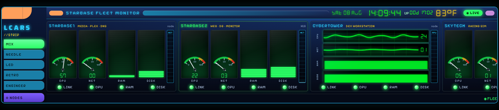
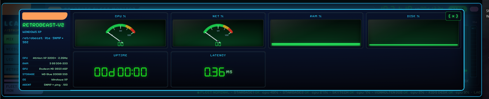
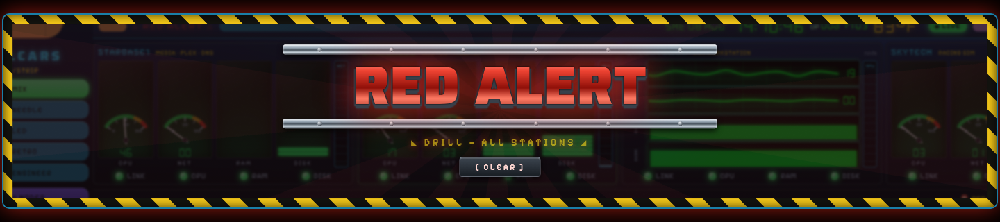
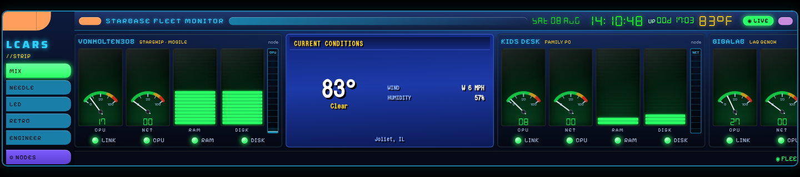
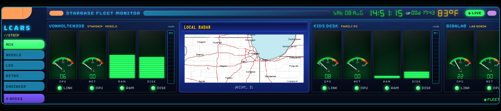
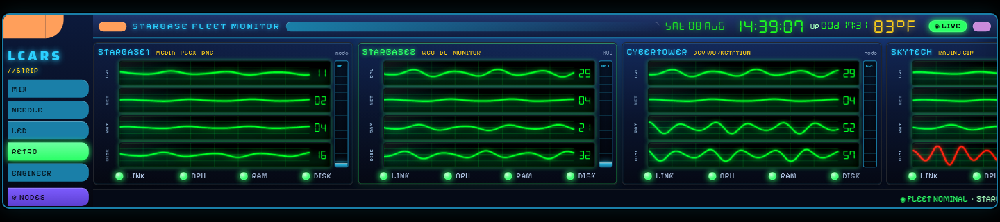

# LCARS_strip

**A retro fleet monitor for your home lab — needle gauges, LED bars, CRT
scanlines — that watches everything from your newest GPU rig down to a
Windows XP box.**



Designed for the **GeeekPi 6.9″ ultrawide LCD touchscreen (1424×280)** in a
1U slot of a 10″ mini rack — but it runs in any browser and scales itself to
any screen. One small Python server, no dependencies, no cloud, no accounts,
no subscriptions. GPLv3.

## What it monitors

| Node type | How | What you get |
|---|---|---|
| **Linux** | polls the node's own [Netdata](https://www.netdata.cloud/) agent (`:19999`) | CPU · NET · RAM · DISK · uptime · NVIDIA GPU util/temp |
| **Windows 10/11** | polls [windows_exporter](https://github.com/prometheus-community/windows_exporter) (`:9182`) + optional [nvidia_gpu_exporter](https://github.com/utkuozdemir/nvidia_gpu_exporter) (`:9835`) | CPU · NET · RAM · DISK · uptime · GPU util/temp |
| **Windows XP / retro** | SNMP (Host Resources MIB) + ping | CPU · RAM · DISK · uptime · latency, in full CRT-green |

Every node is polled **directly** by the panel — there is no aggregation
server, no streaming parent, no message bus. If the panel host can reach the
node's agent port, it's on the strip.



## Features

- **Speedometer needles** for CPU/NET, **LED bar meters** for RAM/DISK, a
  GPU/NET reservoir tank, zone-colored health LEDs (green/amber/red)
- **Touch-first**: tap a card for a full drill-down (hardware specs, GPU °C,
  uptime, latency) · drag to pan · **long-press + drag to reorder** cards
  (order persists)
- **⚙ NODES console** — add a machine by typing its IP and hitting **SCAN**:
  the panel auto-detects Linux / Windows / SNMP and fills in the rest.
  Or hand-edit `/etc/lcars-strip/fleet.json` — same thing.
- **Retro nodes get the retro treatment** — phosphor **oscilloscope faces**:
  live waveform traces whose amplitude and sweep speed follow the load, for the
  XP-era hardware
- Offline nodes dim out and flag the ticker; the panel self-recovers when
  they return
- **🚨 RED ALERT** — a sustained red-zone metric or offline node slams a
  pulsing overlay across the strip (translucent, caution-tape frame, original
  RA-style art). Tap **CLEAR** to acknowledge: the alarm stands down but the
  fault stays flagged in the marquee until the node recovers. Drill button in
  the ⚙ console, because everyone wants to see it fire.
- **⛅ WeatherStar card** — a retro current-conditions card (temp, sky, wind,
  humidity) fed by the free NWS api.weather.gov — no API key. Add a
  `"type": "weather"` node and set `"weather": {"lat": .., "lon": ..}`.
  The card rotates WS4000-style between conditions and **LOCAL RADAR**
  (nearest NOAA RIDGE site, auto-detected). Outside temp + date also join
  the clock in the header.
- **ENGINEER mode** — pick the instrument per metric (needle / LED / scope)
  from the ⚙ console; the panel remembers your loadout. Cards whose meters
  are all scopes/LEDs auto-stack into wide bench-scope rows.

## Gallery

**🚨 RED ALERT** — translucent overlay, caution-tape frame, fleet still visible behind the alarm. Tap CLEAR to acknowledge.



**⛅ WeatherStar card** — current conditions in the Star4000 face, rotating with the local NOAA radar every 12 seconds.





**RETRO mode** — every card as stacked bench-scope rows; trace amplitude and sweep speed follow the load, zone-colored.



## Install (panel host — Linux)

**Debian/Ubuntu/Pop!_OS — grab the `.deb` from
[Releases](https://github.com/VonHoltenCodes/LCARS_strip/releases):**

```bash
sudo apt install ./lcars-strip_*_all.deb
```

**Any distro — from source:**

```bash
git clone https://github.com/VonHoltenCodes/LCARS_strip.git
cd LCARS_strip
sudo ./install.sh
```

(Building the `.deb` yourself: `./packaging/build-deb.sh` → `dist/`.)

Open `http://<panel-host>:8899/`, hit **⚙ NODES**, and start adding IPs.

## Making your machines visible

The panel can only show what your machines report. The rule is simple —
**every monitored node needs one agent and one open port**, reachable from
the panel host. Each OS is a few minutes, once per machine:

| Your machine runs | What you do | Agent · port | Guide |
|---|---|---|---|
| **Linux** (any distro) | paste one Netdata kickstart command | Netdata · `:19999` | [`nodes/linux/README.md`](nodes/linux/README.md) |
| **Windows 10 / 11** | run one PowerShell script (elevated) | windows_exporter · `:9182` | [`nodes/windows/install-windows-exporter.ps1`](nodes/windows/install-windows-exporter.ps1) |
| ↳ *with an NVIDIA GPU* | run a second script for the GPU dial | nvidia_gpu_exporter · `:9835` | [`nodes/windows/install-nvidia-gpu-exporter.ps1`](nodes/windows/install-nvidia-gpu-exporter.ps1) |
| **Windows XP / retro** | enable the built-in SNMP service | SNMP · `161/udp` | [`nodes/xp/README.md`](nodes/xp/README.md) — incl. the `i386` files gotcha |

Then back on the panel: **⚙ NODES → type the IP → SCAN** — the node type,
GPU and basic specs are auto-detected. Each guide also shows how to scope
the agent's firewall rule to the panel host only (recommended — the whole
LAN doesn't need to reach your exporters).

Overview of the whole scheme: [`nodes/README.md`](nodes/README.md).

## Kiosk mode (the 1U touchscreen)

```bash
chromium --kiosk --noerrdialogs --disable-session-crashed-bubble http://localhost:8899/
```

A ready-made systemd user service for boot-to-panel is in `kiosk/` (optional).

## Config

`/etc/lcars-strip/fleet.json` — see [`fleet.json.example`](fleet.json.example).
Top-level: `title` (the header banner text — name your fleet; also editable
live from the ⚙ NODES console), `port`, `poll_seconds`, `weather`
(`{"lat", "lon"}` — enables the header temp and the WeatherStar card), and
`alerts` (RED ALERT thresholds — defaults `{"cpu": 88, "ram": 88,
"disk": 96, "gputemp": 85}`; a node past any of them for ~6s fires the alarm).
Per node: `name`, `host`, `type` (`linux` | `windows` | `xp-snmp`), optional
`use` (role caption), `gpu`, `retro` (CRT styling), `hero` (accent card),
`community` (SNMP), `hw` (spec table shown in the drill-down).

The config API is unauthenticated by design — run this on a LAN you trust,
and don't port-forward the panel to the internet.

## Provenance

Designed and built in the NEONpulse Tech Shop lab: the visual language is
borrowed from our own gear — EasyAmp's brushed chrome and DSEG gauges,
NeonPulse's CRT scanline overlays, and an LCARS frame to hold it together.
First deployment watches nine machines spanning 2003–2025.

## License

GPLv3 — see [LICENSE](LICENSE).
